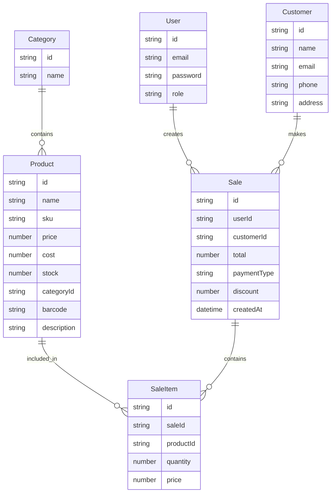

# 🛍️ Modern POS System

**A complete, mobile-first Point of Sale system built for modern businesses**

[](https://nextjs.org/)
[](https://reactjs.org/)
[](https://www.typescriptlang.org/)
[](https://tailwindcss.com/)
[](https://www.prisma.io/)

## ✨ **Features**

### 🚀 **Core System**
- **🔐 Secure Authentication** - JWT-based login with role management
- **📱 Mobile-First Design** - Optimized for phones (320px) and tablets (768px)
- **💱 Multi-Currency Support** - MMK, USD, EUR with real-time switching
- **🔔 Smart Notifications** - Success, error, warning, and confirmation dialogs
- **⚙️ User Settings** - Customizable preferences and system configuration

### 📦 **Product Management**
- **🔄 Full CRUD Operations** - Create, read, update, delete products
- **📂 Category Organization** - Flexible product categorization
- **📊 Stock Tracking** - Real-time inventory management with low-stock alerts
- **📥 Bulk Import System** - Import hundreds of products via CSV
- **🔍 Smart Search** - Quick product search and filtering

### 💰 **Sales Operations**
- **🛒 Quick Sales Entry** - Fast product selection and checkout
- **💳 Payment Processing** - Cash, Card, Mobile Pay support
- **👥 Customer Management** - Complete customer database
- **📈 Sales History** - Comprehensive transaction records
- **📉 Auto Stock Updates** - Automatic inventory adjustment

### 📊 **Analytics & Reports**
- **📅 Sales Reports** - Daily, weekly, monthly summaries
- **📈 Revenue Analytics** - Visual charts and trends
- **🏆 Product Performance** - Top-selling items analysis
- **📤 Export Functionality** - CSV export with real dates
- **📱 Mobile Charts** - Responsive data visualization

## 🎯 **Why Choose This POS System?**

### **For Business Owners**
- **🚀 Easy to Use** - No technical knowledge required
- **📱 Mobile Optimized** - Works perfectly on phones and tablets
- **⚡ Fast Operations** - Quick sales entry and product management
- **📊 Real-time Data** - Live stock updates and sales tracking
- **💰 Cost Effective** - No expensive hardware or software licenses

### **For Cashiers**
- **👆 Touch-Friendly** - Large buttons and intuitive interface
- **🔍 Quick Search** - Find products instantly
- **💳 Multiple Payments** - Support for all payment methods
- **📱 Mobile Ready** - Works on any device
- **🎨 Beautiful UI** - Clean, modern interface

### **For Managers**
- **📊 Live Reports** - Real-time business insights
- **📈 Performance Tracking** - Monitor sales and inventory
- **🔔 Smart Alerts** - Low stock and system notifications
- **📤 Data Export** - Easy reporting and analysis
- **⚙️ Easy Configuration** - Simple settings management

## 🛠 **Technology Stack**

| Category | Technology | Purpose |
|----------|------------|---------|
| **Frontend** | Next.js 15 + React 18 | Modern web framework with App Router |
| **Styling** | Tailwind CSS | Utility-first CSS framework |
| **Language** | TypeScript | Type-safe JavaScript development |
| **Database** | SQLite + Prisma | Local data storage with ORM |
| **Authentication** | JWT | Secure user sessions |
| **File Processing** | csv-parse | CSV import functionality |
| **Security** | bcryptjs | Password hashing |
| **Icons** | Heroicons | Beautiful SVG icon set |

## 🚀 **Quick Start**

### **Prerequisites**
- Node.js 18+ 
- npm or yarn
- Git

### **Installation**

```bash
# Clone the repository
git clone https://github.com/yourusername/modernpos.git
cd modernpos

# Install dependencies
npm install

# Set up environment variables
cp .env.example .env
# Edit .env with your configuration

# Set up database
npx prisma generate
npx prisma db push

# Seed the database with sample data
npm run seed:clothes    # For clothing shop
npm run seed:sales      # For general shop
npm run seed:all        # For both

# Start development server
npm run dev
```

## 📱 **Mobile-First Design**

### **Responsive Breakpoints**
- **📱 Mobile S**: 320px - Icon-only navigation, compact layouts
- **📱 Mobile M**: 480px - Small text, optimized spacing  
- **📱 Tablet**: 768px - Medium text, horizontal layouts
- **💻 Desktop**: 1024px+ - Full features, spacious layouts

### **Touch Optimization**
- **👆 Large Touch Targets** - Minimum 44px button sizes
- **🔄 Swipe Gestures** - Intuitive mobile interactions
- **💡 Long-press Tooltips** - Help text for icon-only buttons
- **📱 Mobile Navigation** - Thumb-friendly bottom navigation

## 📥 **Bulk Import System**

### **How It Works**
1. **📥 Download Template** - Get pre-formatted CSV file
2. **📝 Fill Your Data** - Add products in Excel/Google Sheets
3. **💾 Save as CSV** - Export in CSV format
4. **📤 Upload & Import** - Bulk import hundreds of products

### **CSV Template**
```csv
name,sku,price,cost,stock,category,description,barcode
"Premium T-Shirt","TSH-001",25000,15000,50,"T-Shirts","High-quality cotton","123456789"
"Classic Jeans","JNS-001",45000,28000,30,"Jeans","Comfortable denim","987654321"
```

### **Features**
- ✅ **Auto Category Creation** - New categories created automatically
- ✅ **Duplicate Handling** - Updates existing products by SKU
- ✅ **Data Validation** - Checks for required fields and data types
- ✅ **Error Reporting** - Detailed import results with error details
- ✅ **Mobile Optimized** - Works perfectly on all devices

## 🔒 **Security Features**

- **🔐 JWT Authentication** - Secure session management
- **🔒 Password Hashing** - bcrypt with salt rounds
- **👥 Role-based Access** - Admin vs Cashier permissions
- **🛡️ API Protection** - Middleware security checks
- **📝 Input Validation** - Data sanitization and validation
- **🚫 Rate Limiting** - API abuse prevention

## 📊 **Database Schema**



## 📁 **Project Structure**

```
modernpos/
├── 📱 src/app/              # Next.js App Router
│   ├── 🏠 dashboard/        # Main POS dashboard
│   ├── 🔐 (auth)/          # Authentication
│   ├── 📦 products/        # Product management
│   ├── 💰 sales/           # Sales operations
│   ├── 📊 reports/         # Analytics & reports
│   └── ⚙️ settings/        # User settings
├── 🧩 src/components/      # Reusable UI components
├── 🔌 src/contexts/        # React Context providers
├── 🛠️ src/lib/            # Utility libraries
├── 🗄️ prisma/             # Database management
├── 📚 docs/                # Documentation
└── 🧪 tests/               # Testing files
```

## 🎨 **Screenshots**

### **Dashboard**


### **Mobile View**


### **Bulk Import**


### **Sales Report**


## 🚀 **Deployment**

### **Vercel (Recommended)**
```bash
# Install Vercel CLI
npm i -g vercel

# Deploy
vercel
```

### **Other Platforms**
- **Netlify** - Static site hosting
- **Railway** - Full-stack deployment
- **DigitalOcean** - VPS deployment
- **AWS** - Enterprise deployment

## 📚 **Documentation**

- **📖 [Project Details](projectdetail.md)** - Comprehensive project documentation
- **📥 [Bulk Import Guide](BULK_IMPORT_INSTRUCTIONS.md)** - Step-by-step import instructions
- **🔧 [API Reference](docs/api.md)** - API endpoint documentation
- **🎨 [Component Library](docs/components.md)** - UI component documentation

## 🤝 **Contributing**

We welcome contributions! Please see our [Contributing Guide](CONTRIBUTING.md) for details.

### **Development Setup**
```bash
# Fork and clone
git clone https://github.com/yourusername/modernpos.git
cd modernpos

# Install dependencies
npm install

# Run development server
npm run dev

# Run tests
npm test

# Build for production
npm run build
```

## 📄 **License**

This project is licensed under the MIT License - see the [LICENSE](LICENSE) file for details.

## 🙏 **Acknowledgments**

- **Next.js Team** - Amazing React framework
- **Tailwind CSS** - Utility-first CSS framework
- **Prisma Team** - Type-safe database toolkit
- **Heroicons** - Beautiful icon set
- **Open Source Community** - For all the amazing tools

## 📞 **Support**

- **📧 Email**: support@modernpos.com
- **💬 Discord**: [Join our community](https://discord.gg/modernpos)
- **🐛 Issues**: [GitHub Issues](https://github.com/yourusername/modernpos/issues)
- **📖 Wiki**: [Documentation Wiki](https://github.com/yourusername/modernpos/wiki)

---

## ⭐ **Star This Project**

If this POS system helps your business, please give it a star! ⭐

**Built with ❤️ for modern businesses**
